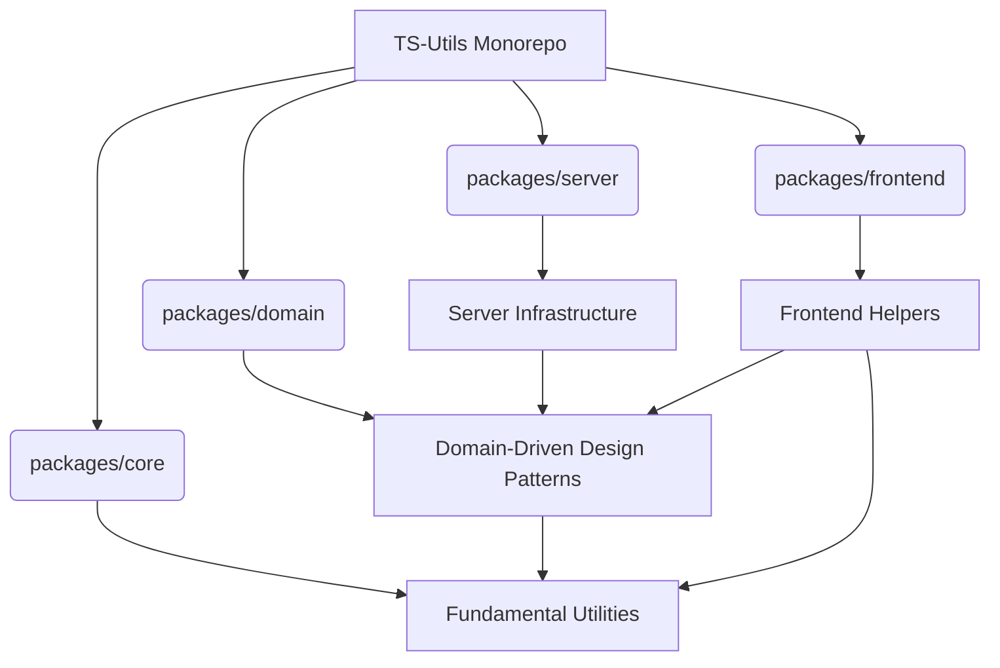
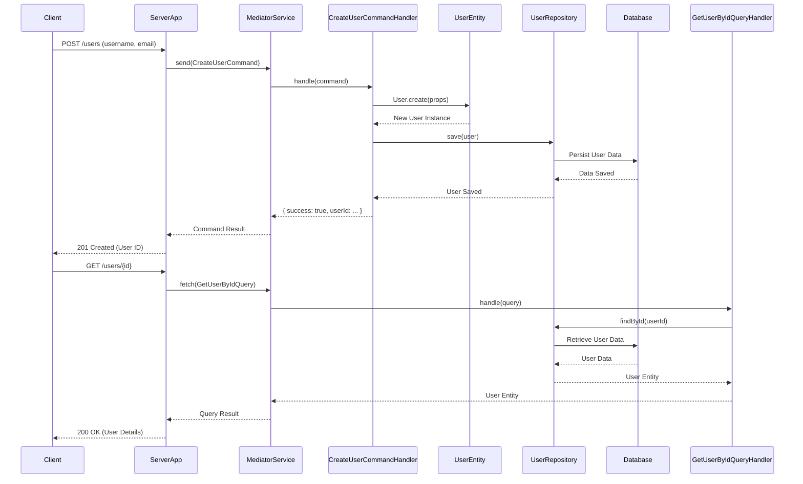

# TS-Utils Monorepo

TS-Utils is a comprehensive suite of TypeScript utility packages designed to streamline development, promote consistent patterns, and reduce boilerplate across various domains. This monorepo centralizes well-tested functionalities, including core utilities, Domain-Driven Design (DDD) patterns, and server infrastructure elements.

## Project Structure

The project is organized as a monorepo using Yarn Workspaces, containing several interconnected packages:



This README focuses on `@ts-utils/core`, `@ts-utils/domain`, and `@ts-utils/server`.

## `@ts-utils/core`

The `@ts-utils/core` package provides fundamental, general-purpose TypeScript utilities that can be used across any project. These utilities aim to simplify common programming tasks and enhance code robustness.

### Key Utilities

*   **`ArrayUtils`**: Helpers for array manipulation.
*   **`StringUtils`**: Utilities for string operations.
*   **`NumberUtils`**: Functions for numerical operations.
*   **`HttpUtils`**: Common HTTP-related functionalities.
*   **`ReflectionUtils`**: Tools for runtime type reflection.
*   **`Validator`**: A robust validation framework.
*   **`UniqueIdentifier`**: (Also in domain, but core provides the base concept) A base class for creating unique identifiers.

### Example Usage: `ReflectionUtils`

`ReflectionUtils` can be used to inspect class properties and methods at runtime, which is particularly useful for decorators or serialization.

```typescript
// packages/core/src/ReflectionUtils.ts (simplified)
export class ReflectionUtils {
    static getPropertyNames(target: any): string[] {
        return Object.getOwnPropertyNames(target);
    }

    static getMethodNames(target: any): string[] {
        return Object.getOwnPropertyNames(target.prototype).filter(
            (prop) => typeof target.prototype[prop] === 'function' && prop !== 'constructor'
        );
    }
}

// Example usage in your application
import { ReflectionUtils } from '@ts-utils/core';

class MyClass {
    public id: string;
    private name: string;

    constructor(id: string, name: string) {
        this.id = id;
        this.name = name;
    }

    myMethod() {
        console.log('Hello');
    }
}

const instance = new MyClass('123', 'Test');

console.log('Properties:', ReflectionUtils.getPropertyNames(instance));
// Expected output: Properties: [ 'id', 'name' ]

console.log('Methods:', ReflectionUtils.getMethodNames(MyClass));
// Expected output: Methods: [ 'myMethod' ]
```

## `@ts-utils/domain`

The `@ts-utils/domain` package implements core Domain-Driven Design (DDD) patterns, providing foundational building blocks for robust and scalable business logic. It helps in structuring your application around the business domain.

### Key DDD Patterns

*   **`Entity`**: Objects with a distinct identity that runs through time and different representations.
*   **`AggregateRoot`**: A cluster of domain objects that can be treated as a single unit for data changes.
*   **`ValueObject`**: Objects that measure, quantify, or describe a thing in the domain. They are immutable and have no conceptual identity.
*   **`UniqueIdentifier`**: A base class for creating strongly typed, unique identifiers for entities and aggregates.
*   **`Repository`**: Abstraction for data persistence operations.
*   **`Events`**: Domain events for capturing significant occurrences within the domain.

### Example: Creating an `Entity` and `UniqueIdentifier`

Let's define a `User` entity with a custom `UserId` unique identifier.

```typescript
// packages/domain/src/UniqueIdentifier.ts (simplified)
export class UniqueIdentifier<T> {
    protected readonly _value: T;

    constructor(value: T) {
        this._value = value;
    }

    public equals(id?: UniqueIdentifier<T>): boolean {
        if (id === null || id === undefined) {
            return false;
        }
        if (!(id instanceof UniqueIdentifier)) {
            return false;
        }
        return id.toValue() === this._value;
    }

    public toValue(): T {
        return this._value;
    }

    toString(): string {
        return String(this._value);
    }
}

// packages/domain/src/Entity.ts (simplified)
import { UniqueIdentifier } from './UniqueIdentifier';

export abstract class Entity<TId extends UniqueIdentifier<any>> {
    protected readonly _id: TId;

    constructor(id: TId) {
        this._id = id;
    }

    public equals(entity?: Entity<TId>): boolean {
        if (entity === null || entity === undefined) {
            return false;
        }
        if (this === entity) {
            return true;
        }
        if (!this._id.equals(entity._id)) {
            return false;
        }
        return true;
    }

    public get id(): TId {
        return this._id;
    }
}

// In your application's domain layer:
import { Entity, UniqueIdentifier } from '@ts-utils/domain';
import { StringUtils } from '@ts-utils/core'; // Example of using a core utility

// 1. Define a custom UniqueIdentifier for User
class UserId extends UniqueIdentifier<string> {
    constructor(id?: string) {
        // Generate a unique ID if not provided, using a core utility
        super(id || StringUtils.generateUuid());
    }
}

// 2. Define the User Entity
interface UserProps {
    username: string;
    email: string;
}

class User extends Entity<UserId> {
    private props: UserProps;

    private constructor(props: UserProps, id?: UserId) {
        super(id || new UserId());
        this.props = props;
    }

    // Factory method to create a new User
    public static create(props: UserProps, id?: UserId): User {
        // Add domain invariants/validations here
        if (!props.username || !props.email) {
            throw new Error('Username and email are required.');
        }
        return new User(props, id);
    }

    // Getters for properties
    get username(): string {
        return this.props.username;
    }

    get email(): string {
        return this.props.email;
    }

    // Example of a domain method
    public changeEmail(newEmail: string): void {
        // Add validation for newEmail
        this.props.email = newEmail;
    }
}

// Usage
const user1 = User.create({ username: 'john.doe', email: 'john@example.com' });
console.log(`User 1 ID: ${user1.id.toValue()}`);
console.log(`User 1 Username: ${user1.username}`);

const user2 = User.create({ username: 'jane.doe', email: 'jane@example.com' }, new UserId('fixed-id-123'));
console.log(`User 2 ID: ${user2.id.toValue()}`);
console.log(`User 2 Email: ${user2.email}`);

user2.changeEmail('jane.new@example.com');
console.log(`User 2 New Email: ${user2.email}`);

console.log(`Are user1 and user2 equal? ${user1.equals(user2)}`);
```

### Entity Lifecycle

```mermaid
graph TD
    A[Create UserProps] --> B{User.create(props, id?)}
    B --> C{Validate Invariants}
    C -->|Valid| D[New User Entity Instance]
    D --> E[User Entity Methods]
    E --> F[Change State (e.g., changeEmail)]
    F --> G[Persist via Repository (External)]
    G --> H[Retrieve via Repository (External)]
    H --> I[Reconstruct User Entity]
    I --> E
```

## `@ts-utils/server`

The `@ts-utils/server` package provides foundational elements for building server-side applications, designed to integrate seamlessly with domain logic defined in `@ts-utils/domain`. It offers abstractions for common server concerns like event handling, command/query mediation, and database repositories.

### Key Components

*   **`MediatorService`**: Implements the Mediator pattern for handling commands and queries, decoupling senders from receivers.
*   **`EventBus`**: A mechanism for publishing and subscribing to domain events, enabling reactive and decoupled architectures.
*   **`Repository` (Interface)**: Defines a contract for data persistence, allowing for various database implementations (e.g., in-memory, Mongo, Postgres, Neo4j).
*   **`HandlerRegistry`**: Manages the registration of command, query, and event handlers.

### Example: Server Setup with `MediatorService` and `Repository`

This example demonstrates how to set up a simple server-side application using components from `@ts-utils/server` to interact with the `User` entity from `@ts-utils/domain`.

```typescript
// packages/server/src/database/repository.interface.ts (simplified)
import { Entity, UniqueIdentifier } from '@ts-utils/domain';

export interface IRepository<TEntity extends Entity<UniqueIdentifier<any>>> {
    save(entity: TEntity): Promise<void>;
    findById(id: UniqueIdentifier<any>): Promise<TEntity | null>;
    findAll(): Promise<TEntity[]>;
    delete(id: UniqueIdentifier<any>): Promise<void>;
}

// packages/server/src/mediator.service.ts (simplified)
import { HandlerRegistry } from './handler.registry';
import { ICommand, IQuery, IEvent, ICommandResult } from '@ts-utils/domain'; // Using types from domain

export class MediatorService {
    constructor(private readonly handlerRegistry: HandlerRegistry) {}

    public async send<TResult extends ICommandResult>(command: ICommand<TResult>): Promise<TResult> {
        const handler = this.handlerRegistry.getCommandHandler(command.constructor.name);
        if (!handler) {
            throw new Error(`No handler found for command: ${command.constructor.name}`);
        }
        return handler.handle(command);
    }

    public async fetch<TResult>(query: IQuery<TResult>): Promise<TResult> {
        const handler = this.handlerRegistry.getQueryHandler(query.constructor.name);
        if (!handler) {
            throw new Error(`No handler found for query: ${query.constructor.name}`);
        }
        return handler.handle(query);
    }

    public async publish(event: IEvent): Promise<void> {
        const handlers = this.handlerRegistry.getEventHandlers(event.constructor.name);
        if (!handlers || handlers.length === 0) {
            console.warn(`No handlers found for event: ${event.constructor.name}`);
            return;
        }
        await Promise.all(handlers.map(handler => handler.handle(event)));
    }
}

// In your application's server layer:
import { UniqueIdentifier } from '@ts-utils/domain';
import { IRepository } from '@ts-utils/server/src/database/repository.interface';
import { MediatorService } from '@ts-utils/server';
import { HandlerRegistry } from '@ts-utils/server/src/handler.registry';
import { ICommand, ICommandHandler, IQuery, IQueryHandler, ICommandResult } from '@ts-utils/domain';

// Assume User and UserId are defined as in the @ts-utils/domain example

// --- 1. Define Commands and Queries ---
interface CreateUserCommandResult extends ICommandResult {
    userId: string;
}

class CreateUserCommand implements ICommand<CreateUserCommandResult> {
    constructor(public readonly username: string, public readonly email: string) {}
}

class GetUserByIdQuery implements IQuery<User | null> {
    constructor(public readonly userId: string) {}
}

// --- 2. Implement a Repository (e.g., In-Memory) ---
class InMemoryUserRepository implements IRepository<User> {
    private users: Map<string, User> = new Map();

    async save(user: User): Promise<void> {
        this.users.set(user.id.toValue(), user);
        console.log(`User saved: ${user.username}`);
    }

    async findById(id: UniqueIdentifier<any>): Promise<User | null> {
        return this.users.get(id.toValue()) || null;
    }

    async findAll(): Promise<User[]> {
        return Array.from(this.users.values());
    }

    async delete(id: UniqueIdentifier<any>): Promise<void> {
        this.users.delete(id.toValue());
        console.log(`User deleted: ${id.toValue()}`);
    }
}

// --- 3. Implement Command and Query Handlers ---
class CreateUserCommandHandler implements ICommandHandler<CreateUserCommand, CreateUserCommandResult> {
    constructor(private readonly userRepository: IRepository<User>) {}

    async handle(command: CreateUserCommand): Promise<CreateUserCommandResult> {
        const user = User.create({ username: command.username, email: command.email });
        await this.userRepository.save(user);
        return { success: true, userId: user.id.toValue() };
    }
}

class GetUserByIdQueryHandler implements IQueryHandler<GetUserByIdQuery, User | null> {
    constructor(private readonly userRepository: IRepository<User>) {}

    async handle(query: GetUserByIdQuery): Promise<User | null> {
        return this.userRepository.findById(new UserId(query.userId));
    }
}

// --- 4. Bootstrap the Server Application ---
async function bootstrapServer() {
    const userRepository = new InMemoryUserRepository();
    const handlerRegistry = new HandlerRegistry();
    const mediator = new MediatorService(handlerRegistry);

    // Register handlers
    handlerRegistry.registerCommandHandler(CreateUserCommand.name, new CreateUserCommandHandler(userRepository));
    handlerRegistry.registerQueryHandler(GetUserByIdQuery.name, new GetUserByIdQueryHandler(userRepository));

    console.log('Server application bootstrapped.');

    // --- Simulate API calls ---
    console.log('\n--- Creating a User ---');
    const createUserResult = await mediator.send(new CreateUserCommand('alice.smith', 'alice@example.com'));
    console.log(`Create User Result: ${JSON.stringify(createUserResult)}`);

    console.log('\n--- Fetching the User ---');
    const fetchedUser = await mediator.fetch(new GetUserByIdQuery(createUserResult.userId));
    if (fetchedUser) {
        console.log(`Fetched User: ${fetchedUser.username}, ${fetchedUser.email}`);
    } else {
        console.log('User not found.');
    }

    console.log('\n--- Attempting to fetch a non-existent User ---');
    const nonExistentUser = await mediator.fetch(new GetUserByIdQuery('non-existent-id'));
    console.log(`Non-existent User: ${nonExistentUser}`);
}

bootstrapServer();
```

### Server Interaction with Domain

```mermaid
graph TD
    A[Client Request] --> B[API Endpoint (e.g., Express/NestJS)]
    B --> C[MediatorService.send/fetch]
    C -->|Command/Query| D[HandlerRegistry]
    D -->|Locate Handler| E[Command/Query Handler]
    E --> F[Interact with Domain Entities/Aggregates]
    F --> G[Repository.save/findById]
    G --> H[Database]
    H --> G
    G --> F
    F --> E
    E -->|Result| C
    C --> B
    B --> I[Client Response]
```

## Example Lifecycle: User Registration

This example illustrates a simplified end-to-end lifecycle for user registration, demonstrating the interaction between `core`, `domain`, and `server` components.



This framework provides a solid foundation for building scalable, maintainable, and type-safe applications by leveraging established patterns and practices.
