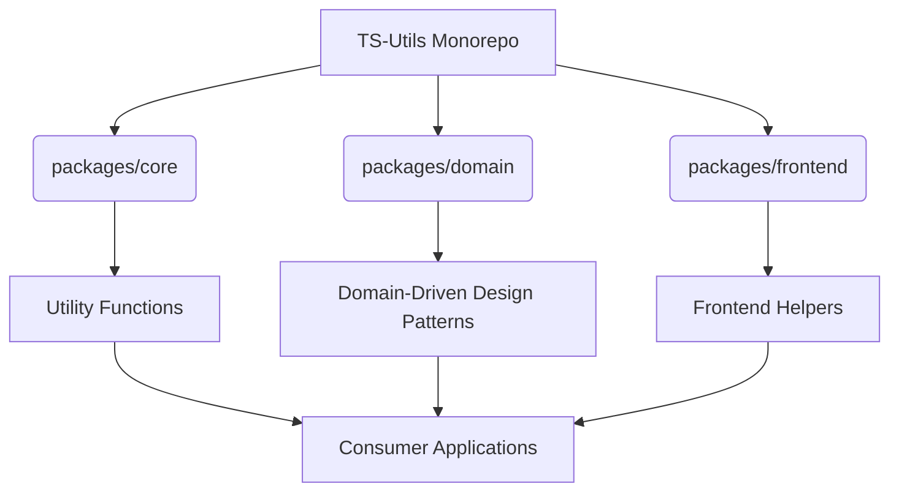

# System Patterns

## System Architecture
The TS-Utils project is structured as a monorepo, managed by Lerna or Yarn Workspaces (to be confirmed, but implied by `packages/` structure). It consists of three main packages: `core`, `domain`, and `frontend`.

## Key Technical Decisions
- **TypeScript First**: All code is written in TypeScript to ensure type safety and improve developer experience.
- **Modular Design**: Each package is self-contained with specific responsibilities.
- **Separation of Concerns**: Clear boundaries between core utilities, domain logic, and frontend concerns.
- **Test-Driven Development (TDD) / Behavior-Driven Development (BDD)**: Implied by the presence of `__tests__` directories and `jest.config.js` files.

## Design Patterns in Use
- **Utility Classes/Functions**: Common in `packages/core` (e.g., `ArrayUtils`, `StringUtils`).
- **Domain-Driven Design (DDD) Patterns**: Explicitly used in `packages/domain` (e.g., `AggregateRoot`, `Entity`, `ValueObject`, `Repository`).
- **Event-Driven Architecture**: Suggested by `EventSource.ts` in `core` and `Events.ts` in `domain`.
- **Singleton/Service Patterns**: Potentially used for `ApiClient`, `ClientConnection`, `ServiceConnection`.
- **Provider Pattern**: Used in `packages/frontend` for `EndpointProvider` and `WebSocketProvider`.

## Component Relationships
- `packages/core` provides foundational utilities that can be consumed by `domain`, `frontend`, or external applications.
- `packages/domain` defines core business logic and entities, which might depend on `core` utilities.
- `packages/frontend` provides UI-related helpers and might depend on both `core` and `domain` packages.

## Critical Implementation Paths
- **Data Validation**: Handled by `Validator.ts` in `core`.
- **API Communication**: Managed by `ApiClient.ts` in `core` and `HttpUtils.ts` in `core` and `frontend`.
- **State Management**: `BaseStore.ts` and `EntityStore.ts` in `frontend` suggest a pattern for managing application state.
- **Event Handling**: `EventSource.ts` and `UpdateHandler.ts` in `core`, and `Events.ts` in `domain`.
