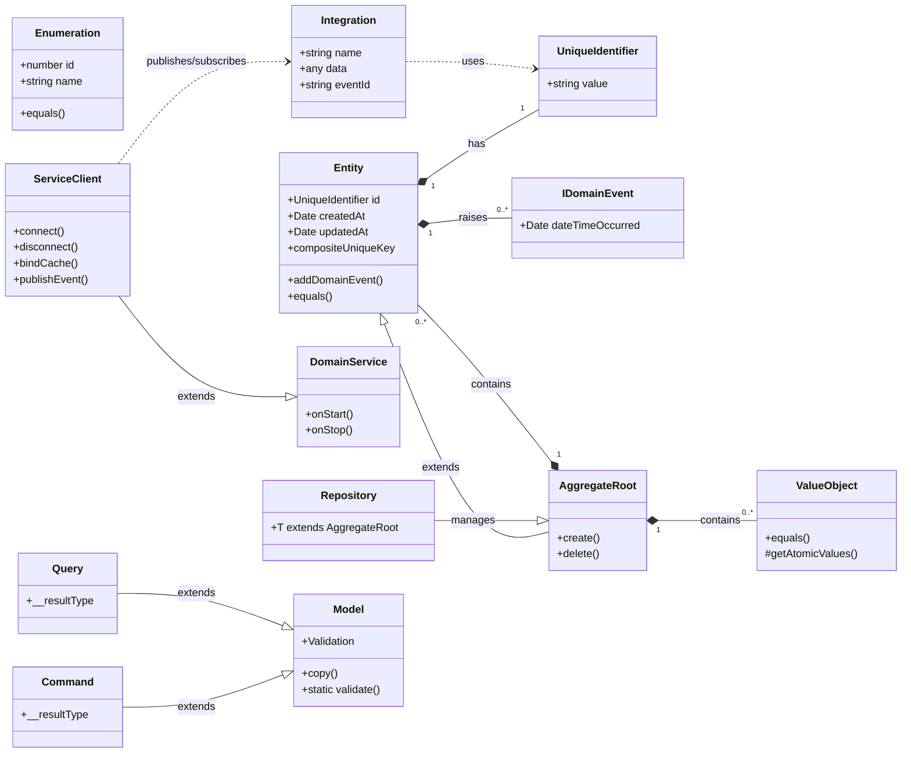

# `@vannatta-software/ts-utils-domain`

This package provides foundational building blocks for implementing Domain-Driven Design (DDD) principles in TypeScript applications. It offers core abstractions for entities, value objects, aggregate roots, and supporting patterns like domain events, repositories, and CQRS types.

The goal of this documentation is to provide a clear, structured understanding of each element, its purpose, internal structure, and how it integrates with other components. This is specifically tailored to assist Large Language Models (LLMs) in comprehending and generating code that adheres to DDD best practices.

## Core DDD Building Blocks

### 1. `Entity` (`Entity.ts`)

**Purpose:**
An `Entity` represents an object that has a distinct identity and a lifecycle within the domain. Unlike Value Objects, Entities are mutable and are identified by their unique identifier, not by their attributes.

**Structure:**
The `Entity` abstract class provides:
-   `id: UniqueIdentifier`: A unique identifier for the entity, typically a UUID.
-   `createdAt: Date`: Timestamp of entity creation.
-   `updatedAt: Date`: Timestamp of the last update to the entity.
-   `_domainEvents: IDomainEvent[]`: A private array to hold domain events raised by the entity.

**Key Functionality:**
-   **Identity:** Identified by its `id`. The `equals` method compares entities based on their `id`.
-   **Domain Event Management:** Methods like `addDomainEvent`, `removeDomainEvent`, and `clearDomainEvents` allow entities to record domain events that occur during their lifecycle. These events can then be published to an `IEventBus`.
-   **Unique Property Composite Key:** The `compositeUniqueKey` getter, in conjunction with the `@UniqueProperty` decorator, allows for generating a unique string key based on specific properties of the entity. This is useful for in-memory uniqueness checks within collections.
-   **Abstract Methods:** `create()` and `delete()` are abstract, requiring concrete entity implementations to define their specific creation and deletion logic.

**Usage for LLMs:**
When designing an entity, focus on its unique identity and behavior. Identify the core properties that define its state and any domain events it might raise. Use `@UniqueProperty` for properties that, when combined, must be unique within a collection (e.g., a `Product` entity might have a unique `sku` property).

```typescript
import { Entity, UniqueIdentifier, UniqueProperty } from '@vannatta-software/ts-utils-domain';

class Product extends Entity {
    @UniqueProperty()
    public sku: string;
    public name: string;
    public price: number;

    constructor(product?: Partial<Product>) {
        super(product);
        this.sku = product?.sku || '';
        this.name = product?.name || '';
        this.price = product?.price || 0;
    }

    create(): void {
        // Logic for creating a product
        this.addDomainEvent({ dateTimeOccurred: new Date(), /* ProductCreatedEvent data */ });
    }

    delete(): void {
        // Logic for deleting a product
    }
}
```

### 2. `ValueObject` (`ValueObject.ts`)

**Purpose:**
A `ValueObject` represents a descriptive aspect of the domain that has no conceptual identity. It is characterized by its attributes, and two Value Objects are considered equal if all their attributes are equal. Value Objects are typically immutable.

**Structure:**
The `ValueObject` abstract class provides:
-   `getAtomicValues(): IterableIterator<any>`: An abstract method that concrete Value Objects must implement to return an iterable of their constituent values. This is crucial for equality comparison.

**Key Functionality:**
-   **Immutability:** While not strictly enforced by the base class, Value Objects are designed to be immutable. Any operation that "changes" a Value Object should return a new instance.
-   **Value Equality:** The `equals` method compares two Value Objects by comparing all their atomic values.
-   **Copying:** The `getCopy()` method provides a shallow copy of the Value Object.
-   **String Representation:** The `toString()` method provides a default string representation based on its atomic values.

**Usage for LLMs:**
Identify concepts that describe something but don't need a unique ID (e.g., `Address`, `Money`, `DateRange`). Ensure all properties are considered for equality and that the object is treated as immutable.

```typescript
import { ValueObject } from '@vannatta-software/ts-utils-domain';

class Address extends ValueObject {
    public street: string;
    public city: string;
    public zipCode: string;

    constructor(street: string, city: string, zipCode: string) {
        super();
        this.street = street;
        this.city = city;
        this.zipCode = zipCode;
    }

    protected *getAtomicValues(): IterableIterator<any> {
        yield this.street;
        yield this.city;
        yield this.zipCode;
    }

    // Example of an immutable "change"
    withStreet(newStreet: string): Address {
        return new Address(newStreet, this.city, this.zipCode);
    }
}
```

### 3. `AggregateRoot` (`AggregateRoot.ts`)

**Purpose:**
An `AggregateRoot` is a special kind of `Entity` that serves as the entry point to an Aggregate. An Aggregate is a cluster of domain objects (Entities and Value Objects) that are treated as a single unit for data changes. The Aggregate Root guarantees the consistency of the objects within its boundary.

**Structure:**
The `AggregateRoot` abstract class simply extends `Entity`. It acts as a marker interface/class to denote the root of an aggregate.

**Key Functionality:**
-   **Consistency Boundary:** All invariants (business rules that must always be true) for the objects within the aggregate are enforced by the Aggregate Root.
-   **Lifecycle Management:** External objects should only hold references to the Aggregate Root's `UniqueIdentifier`, not to its internal entities. Operations on the aggregate go through the root.

**Usage for LLMs:**
When identifying an Aggregate Root, think about which entity is the "owner" or "coordinator" of a group of related objects that must always be consistent together. For example, an `Order` might be an Aggregate Root, containing `OrderLineItem` entities and `ShippingAddress` value objects.

```typescript
import { AggregateRoot, UniqueIdentifier } from '@vannatta-software/ts-utils-domain';
// Assuming OrderLineItem is an Entity and Address is a ValueObject
// import { OrderLineItem } from './OrderLineItem';
// import { Address } from './Address';

class Order extends AggregateRoot {
    public customerId: UniqueIdentifier;
    // public shippingAddress: Address;
    // public lineItems: OrderLineItem[];
    public status: string;

    constructor(order?: Partial<Order>) {
        super(order);
        this.customerId = order?.customerId || UniqueIdentifier.generate();
        // this.shippingAddress = order?.shippingAddress || new Address(...);
        // this.lineItems = order?.lineItems || [];
        this.status = order?.status || 'Pending';
    }

    create(): void {
        // Logic for creating an order
    }

    delete(): void {
        // Logic for deleting an order
    }

    // Methods to enforce invariants within the Order aggregate
    // e.g., addLineItem, confirmOrder, cancelOrder
}
```

### 4. `UniqueIdentifier` (`UniqueIdentifier.ts`)

**Purpose:**
`UniqueIdentifier` provides a strongly-typed wrapper around a string-based unique identifier (UUID). This ensures that IDs are treated as distinct domain concepts rather than just primitive strings, improving type safety and domain expressiveness.

**Structure:**
-   `value: string`: The underlying UUID string.

**Key Functionality:**
-   **Generation:** `UniqueIdentifier.generate()` creates a new UUID.
-   **Parsing:** `UniqueIdentifier.parse(value: string)` validates and creates an instance from a string.
-   **Equality:** The `equals` method compares two `UniqueIdentifier` instances based on their `value`.
-   **Primitive Conversion:** Implements `[Symbol.toPrimitive]` and overrides `toString()` and `valueOf()` for seamless integration with string operations.
-   **Empty ID:** `UniqueIdentifier.Empty` provides a standard "zero" UUID.

**Usage for LLMs:**
Always use `UniqueIdentifier` for entity IDs and any other domain concepts that require a globally unique, immutable identifier. Avoid using raw strings for IDs.

```typescript
import { UniqueIdentifier } from '@vannatta-software/ts-utils-domain';

const userId = UniqueIdentifier.generate();
const productId = new UniqueIdentifier('a1b2c3d4-e5f6-7890-1234-567890abcdef');

if (userId.equals(productId)) {
    // ...
}
console.log(userId.toString()); // Implicit conversion also works
```

### 5. `Enumeration` (`Enumeration.ts`)

**Purpose:**
The `Enumeration` class provides a robust, type-safe alternative to traditional TypeScript enums or string literals for representing a fixed set of named values. It allows for richer behavior and better maintainability.

**Structure:**
-   `id: number`: A numeric identifier for the enumeration instance.
-   `name: string`: A string name for the enumeration instance.
-   `private static registry: Enumeration[]`: A static array to register all instances of concrete enumerations.

**Key Functionality:**
-   **Instance Management:** Static methods like `getAllInstances`, `fromName`, and `from` (by ID) allow for retrieving specific enumeration instances.
-   **Equality:** The `equals` method compares enumeration instances based on their type, `id`, and `name`.
-   **String Representation:** The `toString()` method returns the `name` of the enumeration.
-   **Difference:** `difference` method calculates the absolute difference between two enumeration instances' IDs.

**Usage for LLMs:**
Use `Enumeration` for fixed sets of well-known values that have both a name and an ID, and potentially additional behavior (e.g., `OrderStatus`, `ProductCategory`).

```typescript
import { Enumeration } from '@vannatta-software/ts-utils-domain';

class OrderStatus extends Enumeration {
    public static readonly PENDING = new OrderStatus({ id: 1, name: 'Pending' });
    public static readonly SHIPPED = new OrderStatus({ id: 2, name: 'Shipped' });
    public static readonly DELIVERED = new OrderStatus({ id: 3, name: 'Delivered' });
    public static readonly CANCELLED = new OrderStatus({ id: 4, name: 'Cancelled' });

    private constructor(en?: Partial<OrderStatus>) {
        super(en);
    }

    // Example of adding behavior
    isFinal(): boolean {
        return this.equals(OrderStatus.DELIVERED) || this.equals(OrderStatus.CANCELLED);
    }
}

const status = OrderStatus.fromName(OrderStatus, 'Shipped');
console.log(status.id); // 2
console.log(OrderStatus.getAllInstances(OrderStatus).map(s => s.name)); // ['Pending', 'Shipped', 'Delivered', 'Cancelled']
```

## Supporting Concepts

### 6. `Domain Events` (`Events.ts`)

**Purpose:**
Domain Events are used to capture and communicate that "something significant happened in the domain." They are immutable records of past occurrences and are crucial for implementing eventual consistency, integrating bounded contexts, and reacting to changes.

**Key Interfaces:**
-   `IDomainEvent`: Base interface for all domain events, requiring a `dateTimeOccurred` property.
-   `IDomainEventPublisher`: Interface for publishing domain events.
-   `IEventBus`: Interface for a mechanism to publish and subscribe to `Integration` events (which wrap domain events or other data).

**Usage for LLMs:**
When a significant state change or business process completes within an `AggregateRoot`, consider raising a domain event. These events should be named in the past tense (e.g., `OrderPlaced`, `ProductStockUpdated`).

### 7. `Repository` (`Repository.ts`)

**Purpose:**
A `Repository` abstracts the persistence layer for `AggregateRoot`s. It provides a collection-like interface for storing, retrieving, and querying aggregates, decoupling the domain model from data access concerns.

**Structure:**
The `Repository` abstract class is generic, parameterized by an `AggregateRoot` type (`T extends AggregateRoot`).

**Usage for LLMs:**
Each `AggregateRoot` typically has its own `Repository`. Repositories should only deal with Aggregate Roots, not individual internal entities of an aggregate. They are responsible for ensuring that aggregates are retrieved and saved in a consistent state.

### 8. `Service` (`Service.ts`)

**Purpose:**
This module provides abstractions for `DomainService` and `ServiceClient`.
-   **Domain Services:** Represent operations that don't naturally fit within an `Entity` or `ValueObject` (e.g., transferring money between accounts, which involves two `Account` entities). They are stateless.
-   **Service Clients:** (More akin to Application Services or Infrastructure Services) Handle cross-cutting concerns like HTTP communication, event bus integration, and client-side caching. They orchestrate domain operations and interact with external systems.

**Key Functionality (`ServiceClient`):**
-   **HTTP Communication:** Manages `IHttpClient` for external API calls.
-   **Event Bus Integration:** Connects to an `IEventBus` to `publish` and `subscribe` to `Integration` events.
-   **Cache Management:** Provides mechanisms (`bindCache`, `setCacheAsync`) for client-side caching and notifying bound handlers of cache updates.
-   **Hierarchical Services:** `register` allows composing service clients.

**Usage for LLMs:**
Distinguish between domain logic that belongs to an entity/value object and logic that requires coordination of multiple domain objects or interaction with external systems. Use `DomainService` for the former and `ServiceClient` for the latter.

### 9. `CQRS Types` (`CqrsTypes.ts`)

**Purpose:**
This module defines fundamental types for implementing Command Query Responsibility Segregation (CQRS) and event-driven patterns. CQRS separates the concerns of modifying data (Commands) from querying data (Queries).

**Key Types:**
-   `Command<TResult>`: An abstract class representing an intent to change the state of the system.
-   `Query<TResult>`: An abstract class representing a request for data without side effects.
-   `Integration<TData>`: A wrapper for data (often domain events) published on an event bus, including a name and a unique `eventId`.
-   `ICommandHandler`, `IQueryHandler`, `IEventHandler`, `IIntegrationHandler`: Interfaces for handlers responsible for processing Commands, Queries, and Events/Integrations.
-   `DTO<T>`: A utility type to create Data Transfer Objects by omitting certain internal properties from a model.

**Usage for LLMs:**
When designing operations, categorize them as either Commands (mutating state) or Queries (reading state). Use `Integration` for messages passed over an event bus.

### 10. `Model` (`Model.ts`)

**Purpose:**
The `Model` class provides a base for data structures that require validation. While it can be used for domain models, its primary utility here is for data transfer objects (DTOs), form inputs, or view models where robust validation is needed before processing.

**Key Functionality:**
-   **`@Validation` Decorator:** Allows defining validation rules (e.g., `required`, `min`, `max`, `pattern`, `type`) directly on model properties.
-   **`Model.validate(model: Model)`:** A static method to perform validation against the defined rules, returning a `ValidationState` with `isValid` status and `errors`.
-   **`ValidationError` and `ValidationErrorMap`:** Classes for structured error reporting.
-   **`copy` and `copyArray`:** Utility methods for mapping plain object data onto model instances.

**Usage for LLMs:**
Use `Model` as a base for any data structure that needs declarative validation. This is particularly useful for input validation at the application service layer or for frontend forms.

## Composite Functionality & DDD Principles

To better understand the relationships between the core components, consider the following diagram:



The elements in this package are designed to work together to build a robust and maintainable domain model following DDD principles:

1.  **Building Aggregates:** `AggregateRoot`s encapsulate `Entity`ies and `ValueObject`s. The `AggregateRoot` is the consistency boundary, ensuring that all changes within its scope maintain business invariants. `UniqueIdentifier` is used for the `id` of the `AggregateRoot` and any internal `Entity`ies.
2.  **Behavior-Rich Domain Objects:** `Entity` and `ValueObject` classes are not just data holders; they contain domain logic and enforce business rules. `Enumeration` provides type-safe, behavior-rich fixed value sets.
3.  **Event-Driven Architecture:** `Entity`ies can raise `IDomainEvent`s, which are then published via an `IEventBus` (often managed by a `ServiceClient`). These events can trigger reactions within the same or different bounded contexts, promoting loose coupling and eventual consistency.
4.  **Persistence Abstraction:** `Repository` interfaces define how `AggregateRoot`s are persisted and retrieved, abstracting away the details of the database or storage mechanism.
5.  **Separation of Concerns (CQRS):** `Command`s and `Query`s explicitly define the intent of operations, leading to clearer separation between read and write models. `ICommandHandler` and `IQueryHandler` process these intents.
6.  **Data Validation:** The `Model` class with its `@Validation` decorator provides a declarative way to ensure data integrity, often used for incoming `Command` or `Query` parameters, or DTOs.

**How LLMs Can Leverage This Structure for DDD:**

-   **Identify Bounded Contexts:** LLMs should first identify the distinct bounded contexts within a problem domain.
-   **Define Aggregates:** For each bounded context, identify the `AggregateRoot`s, their internal `Entity`ies, and `ValueObject`s. Remember that `AggregateRoot`s are the only objects directly accessed from outside the aggregate.
-   **Model Entities and Value Objects:**
    -   If a concept needs a unique identity and a lifecycle, model it as an `Entity` with a `UniqueIdentifier`.
    -   If a concept describes something and is defined purely by its attributes, model it as an `ValueObject` and ensure immutability.
-   **Implement Domain Logic:** Place business rules and behaviors directly within the `Entity` and `ValueObject` classes.
-   **Raise Domain Events:** When significant domain events occur, use the `addDomainEvent` method on the `Entity` or `AggregateRoot` to record them.
-   **Define Repositories:** Create abstract `Repository` interfaces for each `AggregateRoot`.
-   **Design Commands and Queries:** For application-level operations, define explicit `Command`s and `Query`s.
-   **Apply Validation:** Use the `Model` class and `@Validation` decorator for input validation.

By understanding these patterns and their interrelationships, LLMs can generate more coherent, maintainable, and DDD-compliant TypeScript code.
